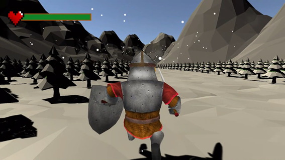

# Samoa and The Dimensional Rift

## Description
The primary goal of this project is to create a complete video game that explores both 3D and 2D mechanics within the Unity game engine.

 Maui, embarks on a quest to save the island of Samoa from the malevolent Tomatoa, utilizing a combination of 2D and 3D gameplay elements. This game showcases the fusion of these technologies to maximize learning and comprehension in the field, providing players with an immersive and challenging gaming experience.

## Table of Contents
- [Story](#story)
- [Game Mechanics](#game-mechanics)
- [Gameplay Video](#gameplay-video)
- [Running the Project](#running-the-project)
- [License](#license)

## Story
Our intrepid hero, Maui, finds himself on the island of Samoa, plagued by the malevolent Tomatoa. Armed with his sword and shield, he embarks on a quest to end the years of darkness that have befallen his village and restore the beauty of Samoa before Tomatoa's arrival.

## Game Mechanics
1. The protagonist can interact with various NPCs along the way by pressing "q" to initiate conversations.

2. The protagonist can navigate through the entire delimited map, including water, using the specified keys below.
3. The protagonist can jump over objects that allow it by pressing space.
4. The protagonist can engage in combat with different enemies encountered on the journey by pressing left mouse button.
5. The protagonist can defend against various enemies encountered on the journey by pressing left mouse button.
6. The protagonist can engage in a final battle in the final level.
8. The protagonist can transition between the 3D and 2D levels and vice versa through portals provided on the map.
9. In 2D platforming levels, there are different types of platforms, including moving and collapsing ones, implementing various mechanics in this dimension.

## Gameplay Video
Watch the full gameplay of our video game by clicking the link below:

Click this [link](https://drive.google.com/file/d/16JE7ZrIm4BxCNzL1qHFY1zkPhZUMKDcy/view?usp=sharing) to view the gameplay video on Google Drive.

## Running the Project

To run the project, follow these steps:

1. Download the project from this GitHub repository. You can either clone it or download it as a ZIP file.

2. Once downloaded, navigate to the "Ejecutable" folder within the project.

3. In the "Executable" folder, you will find an executable file with the `.exe` extension. This file is the game's executable (only for windows operating system).

## License
This project is licensed under the [MIT License](LICENSE.md).

